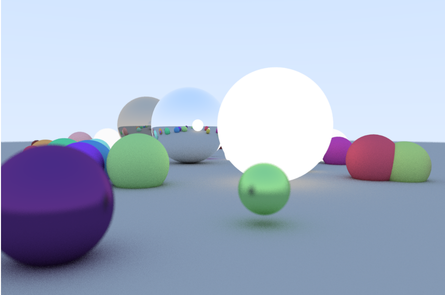

Following Peter Shirley's tutorial, I successfully got a working ray tracer that outputs .ppm files of a random scene. 
## Creating the Image
I started off simply by creating the pixel array for my image, and writing a program that converts the pixels into a ppm file. This was pretty basic. 
Then, I implemented the multi-purpose 3D vector class, and used that to create an origin and direction for my ray class. From there, it was simple to just shoot a ray from the origin in the direction of every pixel in my pixel array, and calculate a color for that ray.
## Creating Objects
I started off by implementing a sphere using a centerpoint and radius. To generalize, we put the sphere as a child of “hitable”, a class representing all objects that can be hit by rays. We also create hitable_group, to group multiple hittable objects into one. For each sphere, using basic linear algebra we can calculate when a ray hits the sphere, and calculate the hit point and normal vector of the surface at that point. We store this information in a “hit_record” structure. 

We also set a “material” property for each of our objects, and each material class (lamb, metal, dielectric) and the “scatter” method in that class implements how a ray hitting that object will be reflected or refracted. 
We cap the number of times a ray can be reflected, and as a result, we now have a simple ray tracer that calculates hits on each object, and calculates a color for each pixel, giving us a realistic looking image. 
## Antialiasing
The resulting image still looks grainy, and the edges of the objects look jagged. We fixed this my implementing a simple antialias feature. For each pixel, we send out many rays in slightly different random directions (still within that pixel), and take the average color value for each RGB value among all the rays. We set up a parameter for the number of samples per pixel, allowing us to balance between render time and image quality. I found around 25 samples to be a good balance point. 

## Camera 
Finally, we added in some camera features, such as being able to define the camera location and camera “look-at” point, which was done with some simple linear algebra. We also added an “aperture” feature, with the main focus distance being set to the distance between the camera location and look-at point, with other objects that are closer or further given a blurry appearance. 
I finished off my creating a random scene generator that generates spheres or random sizes and types, and let the ray tracer do its work.

## Lights
I also attempted to implement lights to this ray tracer. I did this as simple as possible, by creating a new material class to represent a light. A ray hitting light is not scattered, but simply stays with it’s current attenuation, times an intensity factor. I made the brightness of the light be a simple float, representing the max distance that the light shines from that source. The intensity of the light drops off linearly with distance. While this is not how light drops off in real life, I believed it was good enough for such a simple model. 

The end result of all this turned out to be quite good. Here is a simple render with the settings set to get a good-looking image, while limiting the run-time to under 1 minute. We can see spheres of all the different material types (lamb, metal, dielectric, and light)

